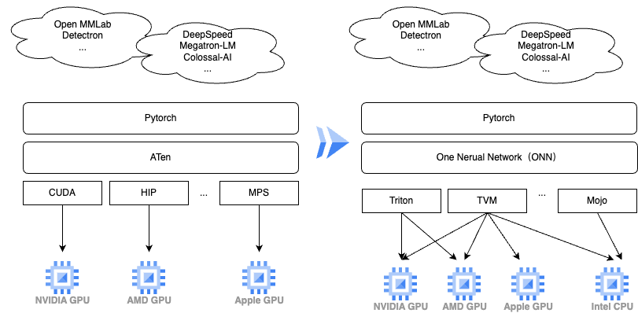

# One Nerual Network (ONN)
This is a cross-chip platform collection of operators and a unified neural network library.
We hope to use this lib to run [OpenMMLab/Detectron/DeepSpeed/Magatron-LM/...] on different chip platforms.
To achieve this goal, we utilized Deep Learning Compiler or DSL (such as,TVM,Triton,... etc) as the backend.
At the same time, we abstracted the operators from some high-level applications.

### Developer Quick Start

If you want to be a developer, you can read this [developer_manual](./md_doc/developer_manual.md)

### User Quick Start

As a user, you can to complete cross chip platform training and inference based on ONN. You can read this [user_manual](./md_doc/user_manual.md)

### Design Manual

You can read this [Design Manual](./md_doc/design_manual.md) for more detail.

### Acknowledgements

- Project Scaffold，From：https://github.com/serious-scaffold/serious-scaffold-python
