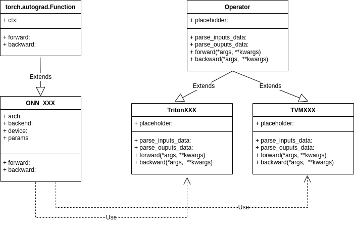

# Design Manual

### project directory structure

The following will introduce the functions of the project directory.
```
- onn
   |-- atomic  // Mainly storing atomic level operators, including add, conv，etc
         |-- backend
                | -- triton
                | -- tvm
   |-- block  // Mainly storing block level operators, including conv-bn-relu, decoder,etc
   |-- cv     // Mainly storing domain operators about computer vision, including NMS, etc
   |-- nlp    // Mainly storing domain operators about nature language processing.
   |-- task   // Mainly storing task operators,including BEVPool, etc
        |--auto-driving
```

### Design of Class


